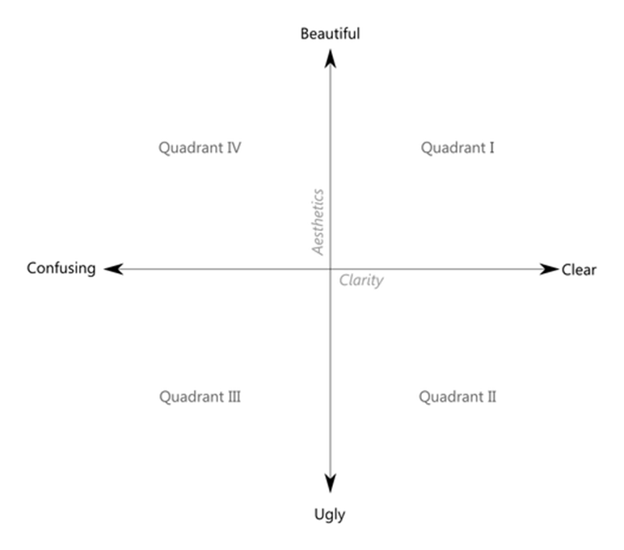
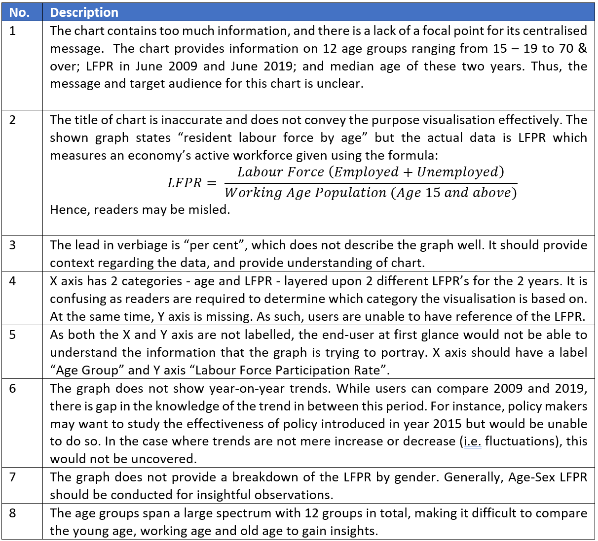

```{r setup, include=FALSE}
knitr::opts_chunk$set(echo = FALSE)
```

# (a) Clarity and Aesthetics Evaluation

__Critic the graph from both its clarity and aesthetics. At least three from each evaluation criterion.__

The Labour Force in Singapore 2019 Report aims to illustrate the situation of Singapore’s labour force. The information provided by the graph is used by individuals, businesses and policy-makers to understand the various labour transformations in Singapore’s labour market, as well as to formulate policies and programmes. However, the extracted graph does not portray information in a __clear__ and __beautiful__ way. 


__Clarity and Aesthetics__

According to Ben Jones, Data Visualisation can be mapped as a single point using clarity and aesthetics as coordinates. The __Clarity__ axis ranges from confusing to clear, whereas the __Aesthetics__ ranges from ugly to beautiful. The style of Data Visualisation can be placed in any of the four quadrants as shown below.



__Why is it not clear?__



__Why is it not "beautiful"?__


# (b) Proposed Design Sketches

__With reference to the critics above, suggest alternative graphical presentation to improve the current design. Sketch out the proposed design. Support your design by describing the advantages or which part of the issue(s) your alternative design try to overcome.__

## Lollipop Chart


__OTHER CHARTS ARE FOR EXPLORATORY PURPOSES__

## Diverging Poulation Pyramid Chart


## Line Chart


# (d) Data Viz Preparation

__Provide step-by-step description on how the data visualization was prepared__

## Data


# (e) Major Observations

__Describe 3 major observations revealed by the data visualization prepared.__


