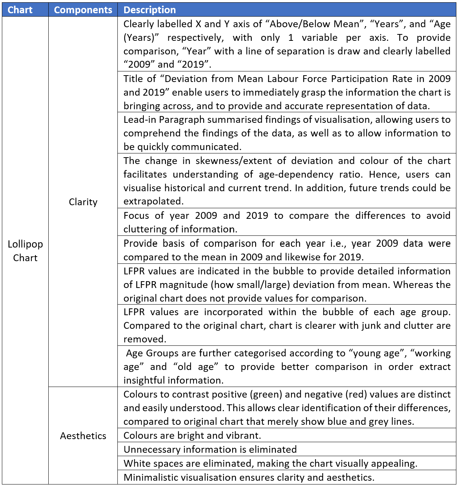

```{r setup, include=FALSE}
knitr::opts_chunk$set(echo = FALSE)
```

# (a) Clarity and Aesthetics Evaluation

__Critic the graph from both its clarity and aesthetics. At least three from each evaluation criterion.__


The Labour Force in Singapore 2019 Report aims to illustrate the situation of Singapore’s labour force. The information provided by the graph is used by individuals, businesses and policy-makers to understand the various labour transformations in Singapore’s labour market, as well as to formulate policies and programmes. However, the extracted graph does not portray information in a __clear__ and __beautiful__ way. 


__Clarity and Aesthetics__

According to Ben Jones, Data Visualisation can be mapped as a single point using clarity and aesthetics as coordinates. The __Clarity__ axis ranges from confusing to clear, whereas the __Aesthetics__ ranges from ugly to beautiful. The style of Data Visualisation can be placed in any of the four quadrants as shown below. The original chart is deemed to be in Quadrant III.


__Why is it not clear?__

No.| Description
-- | -------------
1 | The chart contains too much information, and there is a lack of a focal point for its centralised message.  The chart provides information on 12 age groups ranging from 15 – 19 to 70 & over; LFPR in June 2009 and June 2019; and median age of these two years. Thus, the message and target audience for this chart is unclear. 
2 | The title of chart is inaccurate and does not convey the purpose visualisation effectively. The shown graph states “resident labour force by age” but the actual data is LFPR which measures an economy’s active workforce given using the formula: LFPR =  (Labour Force (Employed+Unemployed))/(Working Age Population (Age 15 and above)). Hence, readers may be misled. 
3 | The lead in verbiage is “per cent”, which does not describe the graph well. It should provide context regarding the data, and provide understanding of chart.
4 | X axis has 2 categories - age and LFPR - layered upon 2 different LFPR’s for the 2 years. It is confusing as readers are required to determine which category the visualisation is based on. At the same time, Y axis is missing. As such, users are unable to have reference of the LFPR. 
5 | As both the X and Y axis are not labelled, the end-user at first glance would not be able to understand the information that the graph is trying to portray. X axis should have a label “Age Group” and Y axis “Labour Force Participation Rate”. 
6 | The graph does not show year-on-year trends. While users can compare 2009 and 2019, there is gap in the knowledge of the trend in between this period. For instance, policy makers may want to study the effectiveness of policy introduced in year 2015 but would be unable to do so. In the case where trends are not mere increase or decrease (i.e. fluctuations), this would not be uncovered. 
7 | The graph does not provide a breakdown of the LFPR by gender. Generally, Age-Sex LFPR should be conducted for insightful observations.
8 | The age groups span a large spectrum with 12 groups in total, making it difficult to compare the young age, working age and old age to gain insights.


__Why is it not "beautiful"?__

No.| Description
-- | -------------
1 | Elements in the chart are not aligned. “Source” and” Note” are not centralized, which may expose unprofessionalism and distrust in the data.
2 | Choice of colour is dull, which may not capture the attention of users. In addition, the colour is inadequate in highlighting differences of data in 2009 and 2019. A more contrasting colour such as red and blue could possibly show a greater distinction. Moreover, Title and “June 2019” line are of the same colour. While consistency could be observed, it may lead to confusion if there is any relation between them. Hence, a lighter font for Title could be used.
3| Excessive information in the chart e.g “Median Age in (Years) = 41 Years” could be truncated to increase the appeal of the chart.
4 | Annotation could be used to emphasise important information. For instance, at the years where LFPR lines coincides. 
5 | Shapes such as arrows could be used to provide direction of change. An example is the change in median age from year 2009 to 2019.


# (b) Proposed Design Sketches

__With reference to the critics above, suggest alternative graphical presentation to improve the current design. Sketch out the proposed design. Support your design by describing the advantages or which part of the issue(s) your alternative design try to overcome.__

## Lollipop Chart





__OTHER CHARTS ARE FOR EXPLORATORY PURPOSES__

## Diverging Poulation Pyramid Chart


## Line Chart


# (d) Data Viz Preparation

__Provide step-by-step description on how the data visualization was prepared__


# (e) Major Observations

__Describe 3 major observations revealed by the data visualization prepared.__


