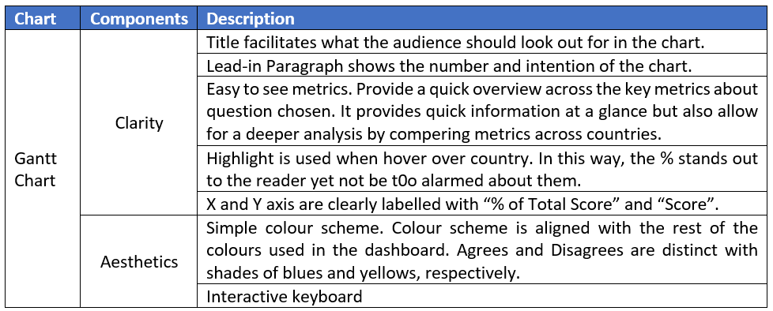
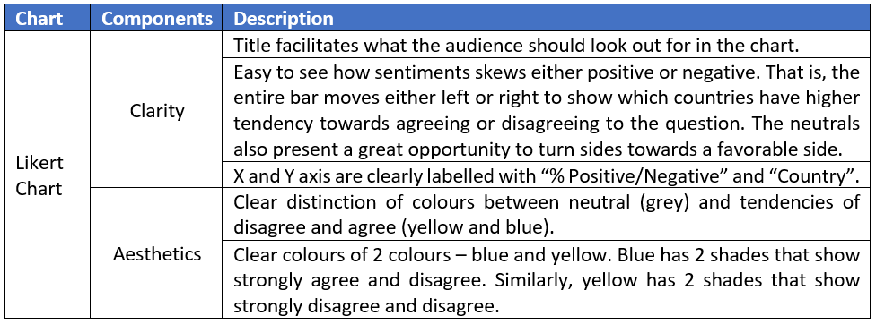
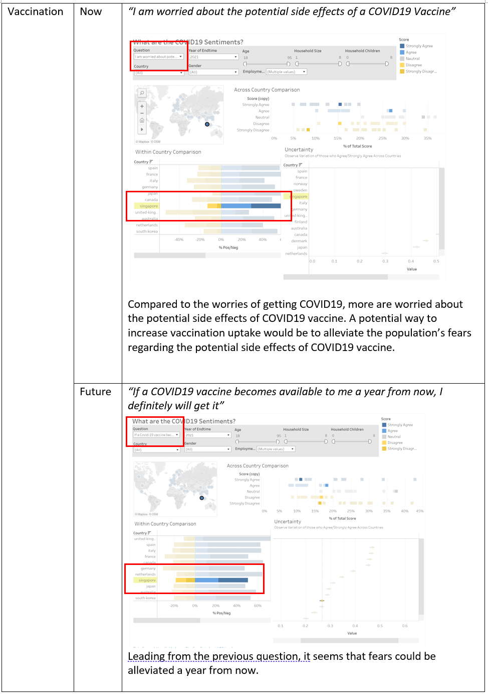

```{r setup, include=FALSE}
knitr::opts_chunk$set(echo = FALSE)
```


# (a) Clarity and Aesthetics Evaluation

__Critic the graph from both its clarity and aesthetics. At least three from each evaluation criterion.__

In 2019, an infection with coronavirus called SARS-CoV-2 emerged and spread globally, causing a global pandemic. According to World Health Organisation (WHO), there have been 108, 579,352 confirmed cases of COVID-19 including 2,396,408 deaths globally as of 15 February 2021. To bring the COVID-19 pandemic to an end, one of the most effective ways to prevent the disease is vaccination. However, the successes of immunisation programmes are moderated by the level of vaccine uptake in the population.  Hence, this report aims to understand the willingness of the public on COVID-19 vaccination using the data from Imperial College London YouGov Covid 19 Behaviour Tracker Data Hub hosted at Github. However, the extracted graphs do not portray information in a clear and beautiful way.


__Clarity and Aesthetics__

According to Ben Jones, Data Visualisation can be mapped as a single point using clarity and aesthetics as coordinates. The __Clarity__ axis ranges from confusing to clear, whereas the __Aesthetics__ ranges from ugly to beautiful. The style of Data Visualisation can be placed in any of the four quadrants as shown below. The original chart is deemed to be in Quadrant III.


__Why is it not clear?__


# (b) Proposed Design Sketches

__With reference to the critics above, suggest alternative graphical presentation to improve the current design. Sketch out the proposed design. Support your design by describing the advantages or which part of the issue(s) your alternative design try to overcome.__


## World Map


## Gantt Chart




## Likert Chart




## Erorr Bar


# (d) Data Viz Preparation

__Provide step-by-step description on how the data visualization was prepared__

## Final Dashboard


## Data Preparation


## World Map


## Gantt Chart


## Likert Chart


## Error Bar


## Dashboard


## Tableau Public


## Github


# Major Observations

__Describe 3 major observations revealed by the data visualization prepared.__


## Case Study in Singapore to reveal observations

Select Singapore on the Map

## Across Country Comparison

Select “Question” and “Year” > Select Singapore on the Map


The audience can see each country and compare the values to each question based on the distribution. i.e., in addition to the country’s sentiments, it can be compared to other countries using the distribution of squares in the plot. 

## Within Country Comparison




