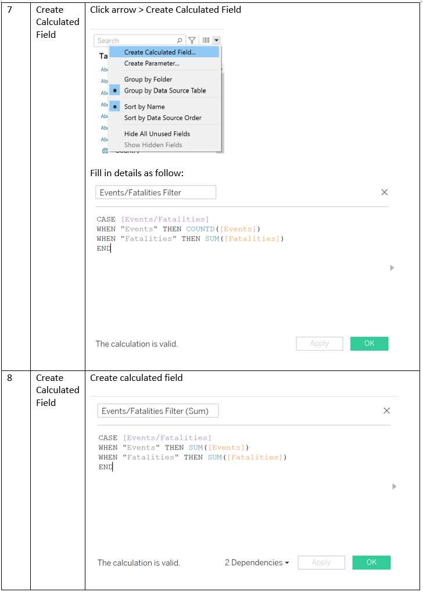

```{r setup, include=FALSE}
knitr::opts_chunk$set(echo = FALSE)
```

# (a) Clarity, Aesthetics and Interactivity Evaluation

__Critic the interactive data visualisation from its clarity, aesthetics and interactivity.  At least two from each evaluation criterion.__

Over the decades, Southeast Asia has experienced a multitude of conflicts ranging from non-violent strategic developments to violent battles with many fatalities. These conflicts as well as fatalities have been experiencing a growing trend. This could be due to countries’ historical and political landscape, coupled with age-old grievances that are unresolved which perpetuate these episodes of conflicts. Thus, this report seeks to explore the trends of conflicts over the years, and to conduct analysis on these spatio-temporal conflicts across Southeast Asia. This visualisation and analysis can be extended to a global scale, as a means to move towards the UN Sustainable Development Goal 16 to reach an end to violence.

The Armed Conflict Location & Event Data Project (ACLED) a non-governmental organisation that disaggregated conflict data collection, analysis, and crisis mapping. The conflict events are into 3 general types and 6 sub-event types as shown below.


__Clarity, Aesthetics and Interactivity__


The original chart provided does not have clarity, aesthetics and interactivity.

 


# (b) Proposed Design Sketches

_With reference to the critics above, suggest alternative data visualisation and interactive techniques to improve the current design.  Support your design by describing the advantages or which part of the issue(s) your alternative design try to overcome._


## Bubble Chart


## Map


## Highlight Table and Bar Chart


# (c) Tableau

__Using Tableau, design the proposed data visualization.__

https://public.tableau.com/profile/joey.chua2685#!/

# (d) Data Viz Preparation

__Provide step-by-step description on how the data visualization was prepared__

## Final Dashboard


## Data Preparation





## Map


## Highlight Table


## Bar Charts


## Bubble Chart


## Dashboard


## Tableau


## Github


# (e) Major Observations

__Describe 3 major observations revealed by the data visualization prepared.__


## Trend Over 10 Years 


From 2010 to 2020, occurrence of events increased from 1657 to 5227. This number peaked in year 2019, reaching a total of 5875 events. Comparatively in the same period, the total number of fatalities rose from 785 to 2046 and peaked in year 2017. With the occurrences of events and fatalities increasing by over 215% and 160% respectively, this number is set to increase in the coming years.


Focusing on year 2019 with the greatest number of events occurrences, the above chart shows an evident concentration in 3 countries, Myanmar, Philippines and Thailand with Philippines having the most event occurrences.


The greatest number of fatalities occurred in year 2017. From the map, it can be seen that Philippines has the largest number of fatalities with high concentration. For Myanmar, certain states such as Maungdaw and Laukkaing experienced more fatalities as compared to the other states. 

## Trend across Southeast Asia

Cumulatively, Myanmar, Philippines and Thailand has the greatest number of conflicts with 10482, 11092 and 8503 events. Similarly, Philippines has the greatest number of conflicts, reaching 12,905 across the 10 years. 


In 2020, Myanmar has highest number of battle event type, which also contributed to the largest number of fatalities. Riots had the least occurrences, with the smallest number of fatalities.


Philippines has a large number of battles and violence against civilians. The latter has resulted in larger number of fatalities as a proportion to event occurrences where fatalities over occurrences is greater than 1.


Thailand’s protests constitute the largest proportion out of other event types with approximately 700 in 2020 compared to others ranging from 0 to 50. However, the number of fatalities for all the events remain low.


## The Details


Across the years, event occurrences peak on October Mondays; Fatalities peak on August Tuesdays.
Events and fatalities are higher in the second half of the year and in the early days of the week.

In 2010, event occurrences peaked in the first half of the year, while in 2020 it peaked in the second half of the year. Both exhibited same trend in terms of the days – peak on weekdays versus weekends.
